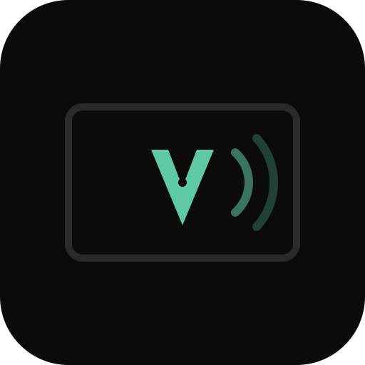
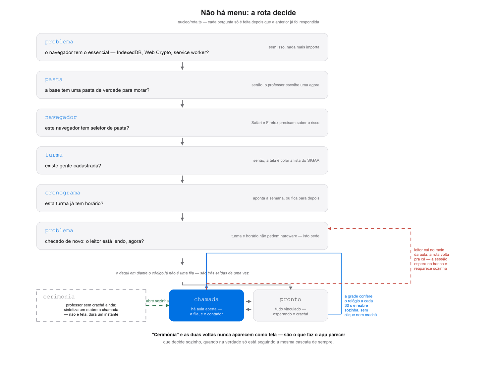
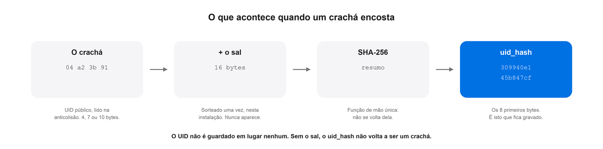
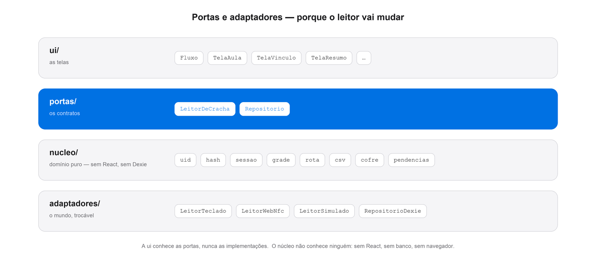

<div align="center">



# Adsum

**Chamada por crachá, sem servidor, sem conta, sem login.**
Os dados ficam numa pasta do computador do professor — e é dela que tudo volta.

[**Abrir o app**](https://willianrupert.github.io/adsum/) ·
[**Ver todas as telas**](https://willianrupert.github.io/adsum/#/vitrine) ·
[**Manual e LGPD**](docs/Adsum-manual-e-LGPD.docx)

[](https://github.com/willianrupert/adsum/actions/workflows/publicar.yml)


</div>

---

O aluno encosta o crachá, a presença é registrada, e no fim da aula existe uma
planilha. Feito para o Centro de Informática da UFPE, em parceria com o
**Prof. Paulo Freitas de Araújo Filho**.

O que torna o problema interessante não é ler um crachá. São duas tensões, e
boa parte das decisões abaixo nasce delas: **a promessa de "dados 100% locais"
é a mesma coisa que a promessa de perder tudo**, e **a tela que pergunta o que
já podia saber sozinha não parece pronta**. A primeira decidiu onde o dado
mora. A segunda decidiu quem decide — e é o que faz o Adsum parecer que
"funciona sozinho" sem nenhuma configuração para ajustar isso.

## O que a tela decide sem perguntar

Não há menu, e a maior parte do que o professor faria por conta própria em
outro app aqui **já aconteceu antes de ele pensar em fazer**. Nada disso é
aprendizado de máquina — é o mesmo tipo de regra que um bom atendente segue:
olhar o que já se sabe antes de perguntar de novo.

**A rota é função pura do estado**, uma cascata de perguntas na ordem em que
importam ([`nucleo/rota.ts`](src/nucleo/rota.ts)). `'problema'` é checada
**duas vezes** — navegador quebrado no topo, leitor parado só depois de turma
e cronograma, porque digitar um horário não pede hardware nenhum. Nenhuma
tela decide sozinha se deve aparecer; todas são o mesmo cálculo, olhado de
ângulos diferentes.

<div align="center"></div>

**A grade abre e fecha a chamada sozinha**, e o cuidado está todo em *quando
ela tem permissão para adivinhar e quando não tem*. Com uma aula batendo com
o relógio agora, ela abre — nem clique, nem crachá. Com duas turmas coladas no
mesmo horário (o CIn tem blocos que terminam e começam no mesmo minuto), ela
recusa escolher e pergunta, porque **entre duas plausíveis o app não
adivinha**. E ela nunca reabre, sozinha, uma aula que acabou de ser encerrada
— fechar às 9h30 uma aula que vai até as 10h não pode ser desfeito pelo
relógio no segundo seguinte. Achado de uso real, do próprio autor: às 13h58,
no meio do bloco de uma turma, a tela dizia "sua próxima aula" apontando
*outra* — o cálculo comparava só o **início** de cada aula, e uma que já
começara perdia para uma que ainda não. O reparo foi comparar pelo fim, e o
repouso passou a dizer exatamente a turma que o botão abaixo dele vai abrir,
nunca uma diferente ([`nucleo/grade.ts`](src/nucleo/grade.ts)).

**Um crachá desconhecido sempre abre a busca — sobre a turma inteira, não só
sobre quem falta.** Parece pouco até se perceber o caso que ela existe para
cobrir: quem perdeu o crachá e trouxe outro **já tem** vínculo, então não está
na fila de pendentes — e sem isto não havia como achar essa pessoa no dia em
que ela aparecia com o cartão novo. A tela nunca vincula um crachá novo a
alguém sem confirmação — **exceto** quando o próprio professor está, naquele
instante, olhando aquela pessoa encostar (o interruptor "Chamar nomes", em
`TelaAula`): aí a confirmação já aconteceu, e perguntar de novo seria
desconfiar do que ele acabou de fazer com os próprios olhos
([`nucleo/sessao.ts`](src/nucleo/sessao.ts), função `decidir`).

**Um professor sem crachá ainda pode dar aula.** "Começar a chamada" sintetiza
um vínculo na hora — o clique e o crachá são gestos equivalentes, não um
atalho que depende do outro ter acontecido primeiro. E uma grade salva antes
de existir qualquer crachá de professor se **autocorrige** assim que um
aparece: o horário que nunca batia com ninguém passa a bater, sem o professor
precisar recadastrar nada nem entender por que não batia antes
([`Fluxo.tsx`](src/ui/Fluxo.tsx), `garantirProfessor` e a reconciliação em
`recontar`).

**Leitura de CSV nunca descarta linha em silêncio.** Toda função de
importação devolve o que leu **e** o que não conseguiu ler, com linha,
conteúdo e motivo — 46 alunos onde a turma tem 48, sem explicação nenhuma, é
bug, não é "deu para importar a maioria".

## A base não pode se perder

Se tudo vive no IndexedDB de um navegador, trocar de computador ou limpar os
dados do site apaga o cadastro da turma inteira — recadastrar 49 alunos é
inaceitável. A saída foi inverter a posse: o professor escolhe uma **pasta de
verdade** ([File System Access][fsa]), e é ela que manda. O IndexedDB vira
cache. Limpar dados do site apaga o handle, **não a pasta** — o professor a
reescolhe e a base inteira é reconstruída. Se a pasta estiver no iCloud ou no
Drive que ele já usa, a cópia fora da máquina vem de graça, sem servidor
nenhum.

Há um teste que **apaga o cache e prova a reconstrução**. É o que separa "cofre"
de "mais um backup".

## O crachá não pode virar identificador

Só o número de série público é lido — nunca autenticando setores, nunca
tocando em Crypto1. E ele não é guardado:

<div align="center"></div>

O sal existe por uma razão precisa: sem ele, o espaço de números de série é
pequeno o bastante para se testar inteiro em segundos, e o resumo seria o crachá
com outra roupa — quem obtivesse a planilha poderia **clonar crachá**. Com ele,
não.

## O registro não pode ser reescrito, mas o crachá pode errar

O log é somente-acréscimo, com `evento_id` como chave de idempotência:
reimportar o mesmo arquivo não duplica linha. A porta `Repositorio` **não
tem** `atualizarEvento` nem `removerEvento` — se a assinatura não existe, o
bug não se escreve.

Isso não pode significar "sem conserto". Confirmar um crachá desconhecido
para a pessoa errada, ou passar duas vezes na pressa — nenhum dos dois se
apaga, os dois ganham um evento nascido pra desfazer o efeito do outro sem
tocar no que já foi escrito: `'Remover crachá'` na chamada, `resultado:
'removido'` na planilha, e `rapido_demais` para o par que chega a menos de
400 ms um do outro. Só-acréscimo não significa sem correção — significa que a
correção também vira linha.

## Arquitetura

<div align="center"></div>

Portas e adaptadores não é cerimônia aqui: **o leitor já mudou duas vezes.**
Começou num aparelho ESP32 que morreu, hoje é um dongle USB que se apresenta
como teclado, e o Web NFC no Android já está adiantado. Trocar o mundo inteiro
embaixo do domínio não custou uma regra.

```
src/
  nucleo/       domínio puro — UID, hash, sessão, grade, rota, CSV. Sem React, sem Dexie.
  portas/       LeitorDeCracha, Repositorio
  adaptadores/  LeitorTeclado (dongle USB), LeitorWebNfc, LeitorSimulado, RepositorioDexie
  ambiente/     capacidades do navegador, pasta, sincronia, som, preferências
  ui/           telas
```

[`src/ui/adsum.ts`](src/ui/adsum.ts) é o **único** lugar que escolhe adaptadores.
Tela que importa `RepositorioDexie` direto é bug de camada.

## Rodar

```bash
npm install && npm run dev
```

Sem hardware, ligue o **modo de ensaio** nos Ajustes: aparecem o leitor
simulado e as teclas <kbd>espaço</kbd> (próximo crachá) e <kbd>P</kbd> (crachá do
professor), que percorrem o fluxo inteiro. Ele vem desligado, e a fronteira é
essa: *se existe para provar que o programa funciona, é ensaio; se existe para
descobrir por que não funcionou, é diagnóstico — e diagnóstico é de produção.*

```bash
npm test     # o núcleo e as telas
npm run build
```

**As telas se testam em jsdom contra o `RepositorioDexie` de verdade**, sem
dublê. Dublê que concorda com tudo é como se descobre tarde que a tela e o
adaptador discordavam — botão morto, `<td>` com `display:flex`, corrida de
presença: todos os defeitos achados até aqui eram desse tipo.

## Documentação

| | |
|---|---|
| [**Manual e LGPD**](docs/Adsum-manual-e-LGPD.docx) | Para o professor e para a instituição. Uso, e a descrição do tratamento de dados campo por campo |
| [`CLAUDE.md`](CLAUDE.md) | O contrato do projeto: regras que não se quebram, decisões e o que elas custaram |
| [`docs/00_roadmap.md`](docs/00_roadmap.md) | Os passos do projeto, cada um terminando em algo que já roda no navegador |
| [`docs/01_cofre.md`](docs/01_cofre.md) | O cofre em pasta, o prazo do Safari, e o bug do sal que perdia as pessoas |
| [`docs/02_formato.md`](docs/02_formato.md) | O formato dos arquivos, decidido do zero |
| [`docs/03_visual.md`](docs/03_visual.md) | Os valores medidos da linguagem visual da Apple |
| [`docs/04_historico.md`](docs/04_historico.md) | Histórico de decisões datado — o porquê de cada mudança, na ordem em que aconteceu |

Comentário aqui explica **por quê**, não o quê — e registra o que a decisão
custou. Boa parte do raciocínio mora no código, não em documento à parte.

## Privacidade, em uma linha cada

- Nenhum dado sai do computador sem gesto explícito do professor
- Sem telemetria, sem analytics, sem fonte remota, sem CDN — o `runtimeCaching`
  do service worker é vazio de propósito
- O login do SIGAA **não é lido**: é credencial de acesso, e credencial não entra
  em arquivo de frequência. A matrícula identifica sem destravar nada
- Dado real de turma nunca entra no repositório. Os testes usam gente inventada
  na forma exata da página real, e as ilustrações são **desenhadas** por script —
  versiona-se o desenho, nunca a captura

## Estado

Funciona de ponta a ponta e está publicado. O dongle já foi conferido com
hardware de verdade — decimal de 10 dígitos, big-endian, com o ritmo real
medido entre caracteres — e há teste automatizado provando isso do teclado até
o UID. Falta comparar o UID que o celular entrega, pelo Web NFC, com o que o
dongle lê no mesmo crachá: pilhas NFC divergem nisso, e o problema apareceria
na frente da turma.

<div align="center">

**·**

<sub><i>Adsum</i> — o que se responde na chamada.</sub>

</div>

[fsa]: https://developer.mozilla.org/en-US/docs/Web/API/File_System_API
