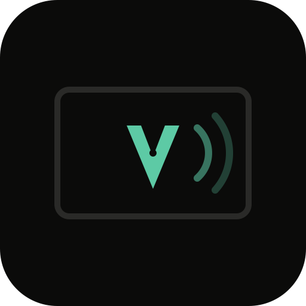
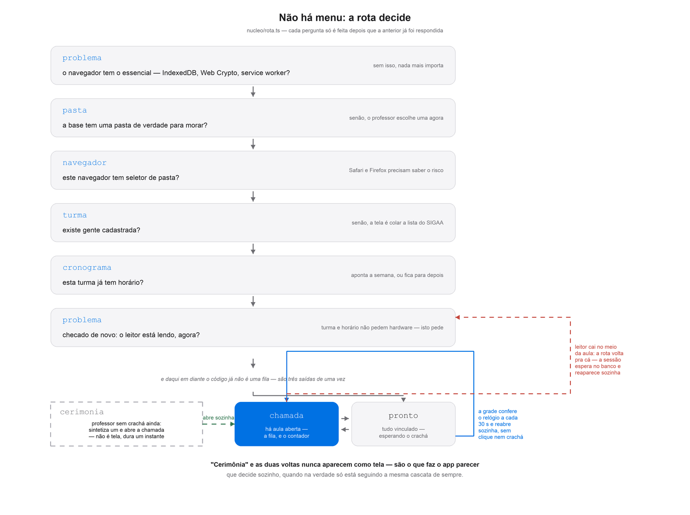
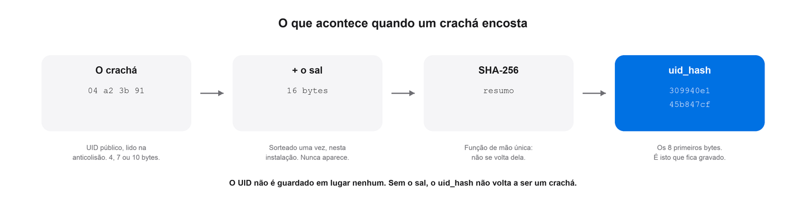
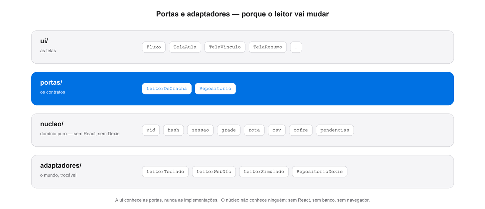

<div align="center">



# Adsum

**Chamada por crachá, sem servidor, sem conta, sem login.**

O aluno encosta o crachá, a presença é registrada, e no fim da aula existe uma
planilha. Os dados ficam numa pasta do computador do professor, e é dela que
tudo volta.

[**Abrir o app**](https://willianrupert.github.io/adsum/) ·
[**Ver todas as telas**](https://willianrupert.github.io/adsum/#/vitrine) ·
[**Manual e LGPD**](docs/Adsum-manual-e-LGPD.docx) ·
[**Documentação**](docs/README.md)

[](https://github.com/willianrupert/adsum/actions/workflows/publicar.yml)


[](LICENSE)

</div>

---

Feito para o Centro de Informática da UFPE, em parceria com o
**Prof. Paulo Freitas de Araújo Filho**, e em uso em sala de aula.

O problema interessante não é ler um crachá. São duas tensões, e boa parte das
decisões abaixo nasce delas:

- **"Dados 100% locais" é a mesma promessa que "perder tudo".** Sem servidor,
  o cadastro de uma turma inteira vive num navegador que pode ser limpo,
  trocado ou apagado. A resposta decidiu onde o dado mora.
- **Uma tela que pergunta o que já podia saber não parece pronta.** Numa fila
  de cinquenta alunos, cada pergunta é uma pessoa esperando. A resposta decidiu
  quem decide.

## O que o Adsum faz

| | |
|---|---|
| **Chamada numa tela só** | Presença e cadastro acontecem no mesmo gesto. Quem ainda não tem crachá é cadastrado ali mesmo, com a pessoa na frente. |
| **Lista direto do SIGAA** | Cola-se a página de participantes; o Adsum lê nome e matrícula e confere o total contra o que a página declara. |
| **Planilha sempre pronta** | Com a pasta escolhida, cada presença vai para o disco no ato, e a planilha de faltas se refaz sozinha. Não existe botão de exportar. |
| **Correção sem apagar nada** | "Não presente", "Remover crachá" e presença à mão viram linhas novas; o registro nunca é reescrito. |
| **Funciona offline** | Depois de aberto uma vez, o app roda sem rede, do começo ao fim. |
| **Diagnóstico de verdade** | Um diário por dia, sem nome nem número de crachá, diz o que o app fez com cada leitura e quanto tempo levou. |

## Como funciona

**A tela decorre do estado.** Não há menu. Sem pasta, a tela é escolher onde
guardar; sem turma, é colar a lista; na hora da aula, é a chamada. A rota é
uma função pura, uma cascata de perguntas na ordem em que importam
([`nucleo/rota.ts`](src/nucleo/rota.ts)), e nenhuma tela decide sozinha se deve
aparecer.

<div align="center"></div>

**A grade sugere; o professor abre.** Na hora da aula, a tela inicial já
mostra a turma certa, marcada com um ponto azul, e um gesto abre a chamada: o
botão, o Enter ou o crachá do professor. A grade não abre sozinha de
propósito: a hora em que uma aula começa de verdade quase nunca é a da grade.
Com duas turmas coladas no mesmo horário (o CIn tem blocos que terminam e
começam no mesmo minuto), nenhuma ganha o ponto azul: entre duas plausíveis, o
app não adivinha ([`nucleo/grade.ts`](src/nucleo/grade.ts)).

**Um crachá desconhecido abre a busca sobre a turma inteira**, não só sobre
quem falta. Quem perdeu o crachá e trouxe outro já tem vínculo, então não está
na fila de pendentes, e sem isso não seria achado no dia do cartão novo. O app
nunca vincula um crachá sem confirmação, com uma exceção: quando o professor
liga "Chamar nomes" e está olhando aquela pessoa encostar. Aí a confirmação já
aconteceu ([`nucleo/sessao.ts`](src/nucleo/sessao.ts)).

**O dongle é um teclado.** O leitor USB "digita" o número do crachá, e o Adsum
o separa de uma pessoa digitando pelo ritmo: dezenas de milissegundos entre
teclas, contra centenas de um humano. Sem driver, sem permissão, igual em todo
navegador ([`nucleo/digitacao.ts`](src/nucleo/digitacao.ts)).

## Confiável por construção

Cada garantia abaixo existe porque, sem ela, algo se perdeu ou quase se perdeu
em sala. A história de cada uma está em
[`docs/06_falhas_em_sala.md`](docs/06_falhas_em_sala.md).

**A pasta é a dona dos dados.** O professor escolhe uma pasta de verdade
([File System Access][fsa]), e a base no navegador vira cache. Limpar os dados
do site apaga o cache, não a pasta: reescolhida a pasta, a base inteira volta.
Se ela estiver no iCloud ou no Drive, a cópia fora da máquina vem de graça. Há
teste que apaga o cache e prova a reconstrução ([`docs/01_cofre.md`](docs/01_cofre.md)).

**O registro só cresce.** O log é somente-acréscimo, com `evento_id` como chave
de idempotência. A porta `Repositorio` não tem `atualizarEvento` nem
`removerEvento`: se a assinatura não existe, o bug não se escreve. O número de
cada evento é reservado numa transação e só anda para frente, e todo evento
novo passa por um caminho só.

**Nenhuma falha é silenciosa.** Leitura de CSV devolve o que leu e o que não
conseguiu, com linha e motivo. Gravação que falha vira aviso na tela, e o dado
espera na base até o conserto. Uma leitura que não virou crachá toca e avisa.
Ao ligar a pasta e ao encerrar a chamada, o log do disco e a base são
conferidos nos dois sentidos.

**Aguenta a fila mais rápida que a sala.** Um teste monta o app inteiro com a
pasta ligada e uma turma de 300, dispara 300 crachás em rajada e confere no
disco que nenhum se perdeu. Foi esse teste que achou gravações simultâneas no
mesmo arquivo apagando uma à outra, e uma lista que custava mais a cada aluno
a mais. Hoje as gravações de um arquivo andam em fila, o recálculo se agrupa
por rajada, e o custo por crachá não cresce com a turma
([`docs/10_codigo.md`](docs/10_codigo.md)).

**Nada chega à sala sem ensaio.** Depois de todo deploy, um roteiro de sete
passos roda sobre a cópia do cofre de um professor real, com o dongle de
verdade, porque base limpa esconde justamente a classe de defeito que chega à
sala ([`docs/07_ensaio_antes_da_aula.md`](docs/07_ensaio_antes_da_aula.md)).

## Privacidade

Só o número de série público do crachá é lido: nunca autenticando setores,
nunca tocando em chave. E ele não é guardado.

<div align="center"></div>

O sal existe por uma razão precisa: sem ele, o espaço de números de série é
pequeno o bastante para se testar inteiro em segundos, e quem obtivesse a
planilha poderia clonar um crachá. Com ele, não. Nenhum sal é descartado: um
crachá é procurado em todos os que a instalação já teve.

- Nenhum dado sai do computador sem gesto explícito do professor. Sem
  telemetria, analytics, fonte remota nem CDN.
- O login do SIGAA não é lido: é credencial de acesso. A matrícula identifica
  sem destravar nada.
- Dado real de turma nunca entra neste repositório. Os testes usam gente
  inventada na forma exata da página real, e as imagens são desenhadas por
  script.
- O tratamento de dados, campo por campo, está no
  [manual](docs/Adsum-manual-e-LGPD.docx), escrito para o professor e para a
  instituição.

## Começar

**Para dar aula:** abra [o app](https://willianrupert.github.io/adsum/) no
Chrome ou no Edge, escolha uma pasta, cole a página de participantes do SIGAA,
e ligue o dongle. O [manual](docs/Adsum-manual-e-LGPD.docx) cobre o resto, e
[`#/vitrine`](https://willianrupert.github.io/adsum/#/vitrine) mostra todas as
telas com gente inventada.

**Para desenvolver:**

```bash
npm install
npm run dev
```

Sem hardware, ligue o **modo de ensaio** nos Ajustes: aparecem o leitor
simulado e as teclas <kbd>espaço</kbd> (próximo crachá), <kbd>N</kbd> (crachá
novo) e <kbd>P</kbd> (crachá do professor). A fronteira é esta: o que existe
para provar que o programa funciona é ensaio; o que existe para descobrir por
que não funcionou é diagnóstico, e fica no app publicado.

```bash
npm test          # domínio, adaptadores, telas e o teste de carga
npm run lint
npm run build     # tsc -b e vite build
```

**As telas se testam em jsdom contra o `RepositorioDexie` de verdade**, sem
dublê. Dublê que concorda com tudo é como se descobre tarde que a tela e o
adaptador discordavam. As falhas de sala viram cofres anonimizados
(`src/testes/cofres/`), e o conserto é provado sobre a base como ela estava.

## Arquitetura

<div align="center"></div>

Portas e adaptadores não é cerimônia aqui: **o leitor já mudou duas vezes.**
Começou num aparelho ESP32 que foi aposentado, hoje é um dongle USB que se
apresenta como teclado, e há adaptadores prontos para um leitor serial e para
o NFC do Android. Trocar o mundo embaixo do domínio não custou uma regra.

```
src/
  nucleo/       domínio puro: sessão, chamada, grade, rota, faltas, CSV. Sem React, sem Dexie.
  portas/       LeitorDeCracha, Repositorio
  adaptadores/  LeitorTeclado, LeitorSerial, LeitorWebNfc, LeitorSimulado, RepositorioDexie
  ambiente/     o navegador: pasta, sincronia, diário, agendador, preferências, som
  ui/           a casca, as telas, e as peças delas (ui/hooks, ui/aula)
```

[`src/ui/adsum.ts`](src/ui/adsum.ts) é o único lugar que escolhe adaptadores.
O mapa módulo por módulo e o caminho de um crachá estão em
[`docs/10_codigo.md`](docs/10_codigo.md).

Pilha: React, TypeScript, Vite e Dexie (IndexedDB), publicado como PWA no
GitHub Pages. Ferramentas de bancada (um emulador de crachá e um rig de teclado
em ESP32) ficam em [`ferramentas/`](ferramentas/).

## Documentação

| | |
|---|---|
| [`docs/README.md`](docs/README.md) | O índice: o que é cada documento e por onde começar |
| [**Manual e LGPD**](docs/Adsum-manual-e-LGPD.docx) | Para o professor e para a instituição: uso, e o tratamento de dados campo por campo |
| [`CLAUDE.md`](CLAUDE.md) | O contrato do projeto: as regras que não se quebram e o que cada decisão custou |
| [`docs/00_roadmap.md`](docs/00_roadmap.md) | Onde o projeto está e o que vem depois |
| [`docs/01_cofre.md`](docs/01_cofre.md) | A pasta como dona dos dados, o prazo do Safari, o chaveiro de sais |
| [`docs/04_historico.md`](docs/04_historico.md) | As decisões, datadas, na ordem em que aconteceram |
| [`docs/08_lancar_no_sigaa.md`](docs/08_lancar_no_sigaa.md) | A próxima versão: levar as presenças ao SIGAA, com o Gravar sempre do professor |
| [`docs/10_codigo.md`](docs/10_codigo.md) | O código: camadas, o caminho de um crachá, as garantias sob carga |

## Estado e próximos passos

Em uso real, com o dongle conferido em hardware de verdade (decimal de 10
dígitos, big-endian) e teste automatizado do teclado até o UID. Mudanças
passam por um período de uso limpo antes de funcionalidade nova entrar, e a
próxima é o lançamento das presenças no SIGAA, desenhada e à espera
([`docs/00_roadmap.md`](docs/00_roadmap.md)).

## Créditos

Criado por **Willian Rupert**, com o **Prof. Paulo Freitas de Araújo Filho**
(CIn/UFPE), que levou o Adsum para a sala de aula e pediu boa parte do que ele
faz. O desenho do lançamento no SIGAA parte do trabalho do Prof. Filipe
Calegario ([auto-sigaa](https://github.com/filipecalegario/auto-sigaa)).

## Licença

[MIT](LICENSE), para o código e para os documentos, incluindo o manual e as
imagens geradas. Pode ser usado, adaptado e redistribuído, mantendo o aviso de
copyright.

<div align="center">

**·**

<sub><i>Adsum</i>: o que se responde na chamada.</sub>

</div>

[fsa]: https://developer.mozilla.org/en-US/docs/Web/API/File_System_API
