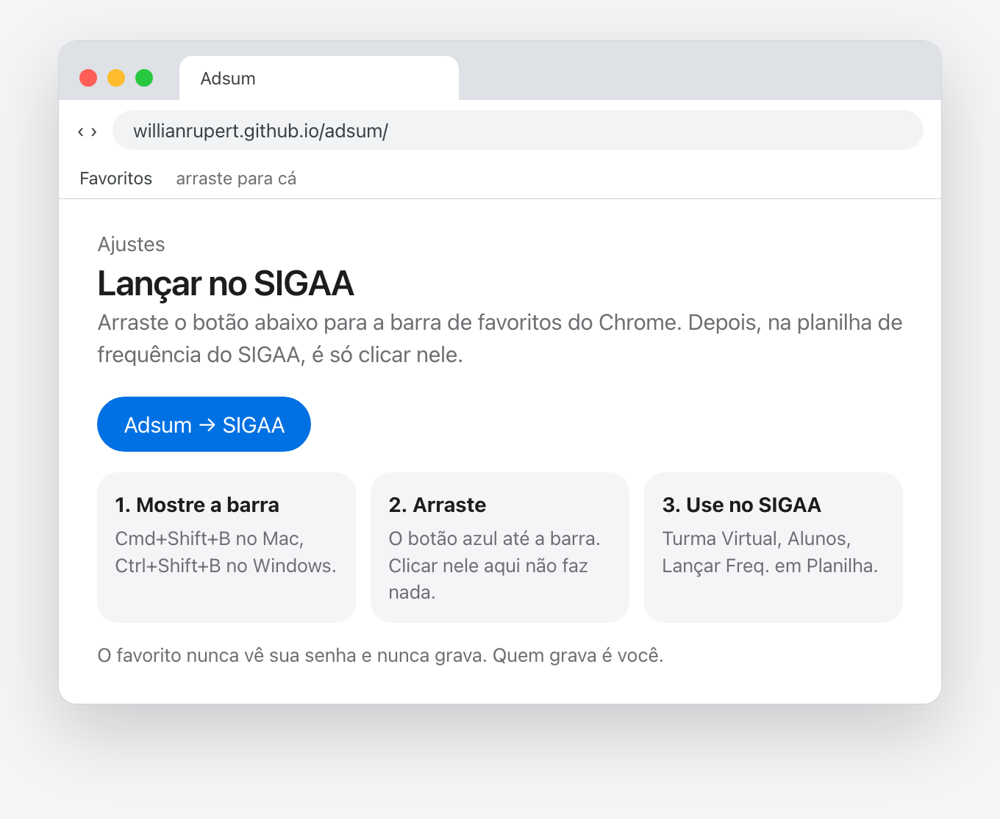
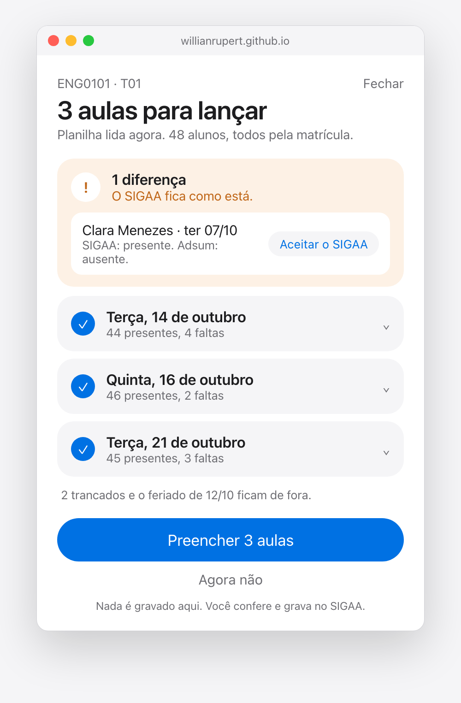
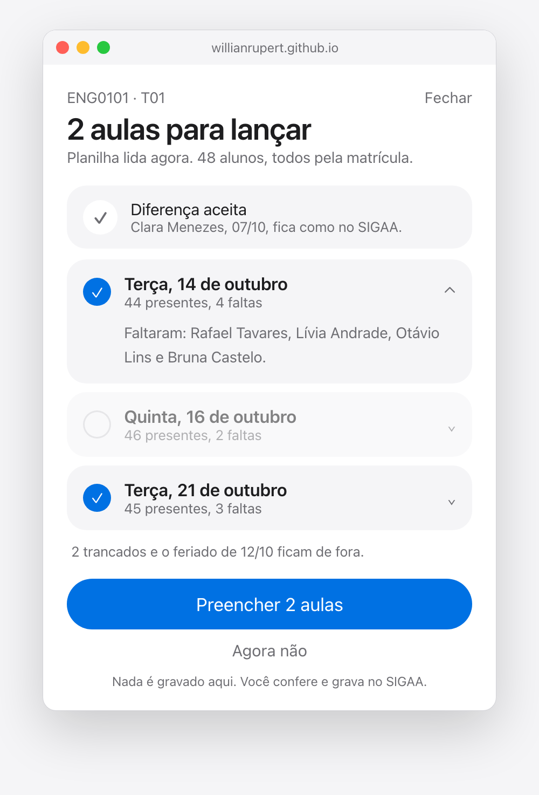
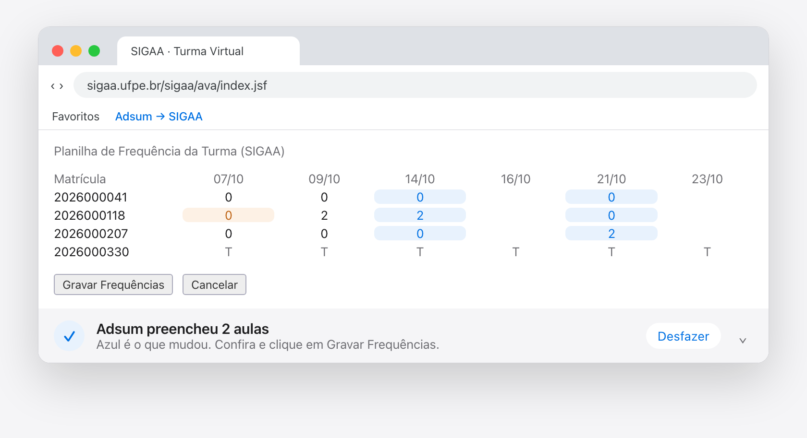
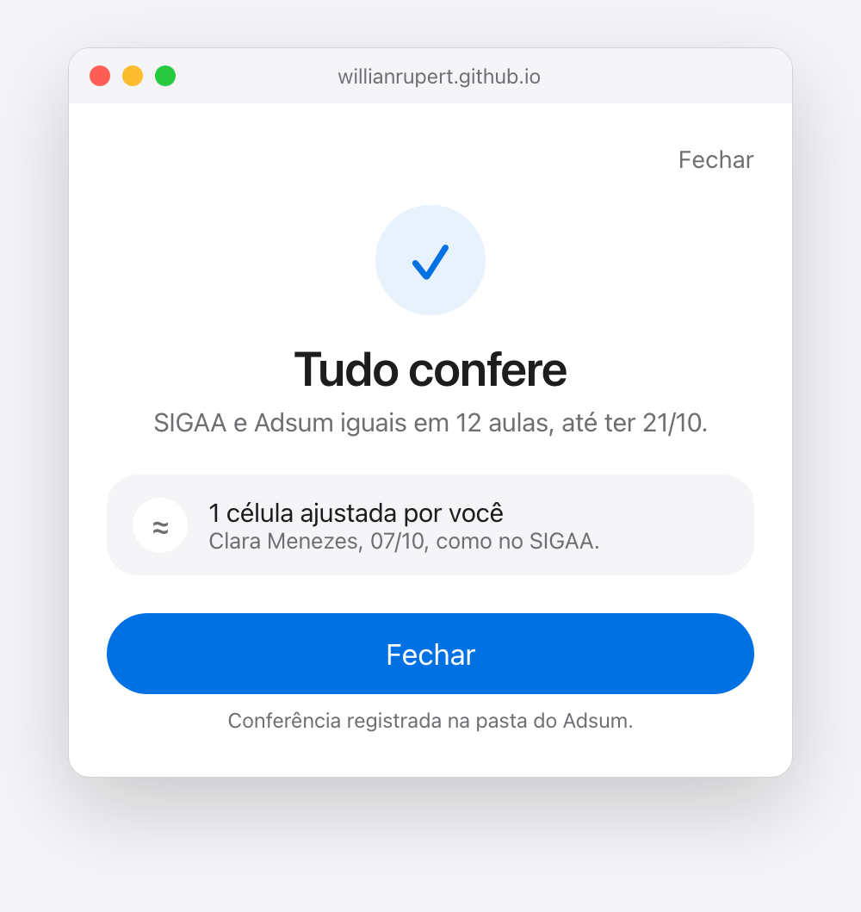
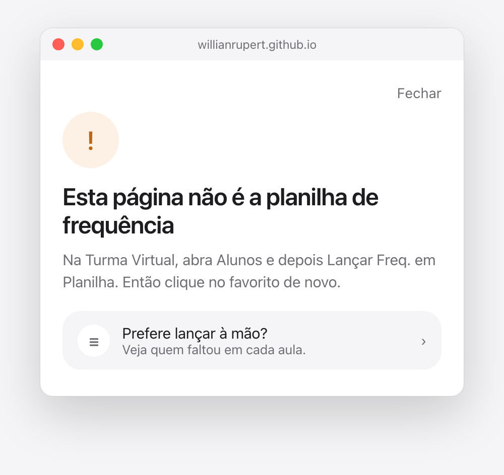

# 09 — Esboço da janela do favorito

As telas da v2 (`docs/08_lancar_no_sigaa.md`) antes de uma linha de código.
Esboço de 24/09/2026. É desenho, não captura: o desenho é
[`esboco_sigaa/esboco.html`](esboco_sigaa/esboco.html), com os tokens do
`estilo.css` e gente inventada, e as imagens saem dele por
`scripts/gerar_esboco_sigaa.py`. Mudar uma tela é mudar o HTML e rodar o
script de novo.

A regra que todas seguem: **a janela é o Adsum, não uma tela nova.** Mesma
cor, mesma pílula, mesmo cartão com ícone à esquerda, nenhuma sombra nem
borda separando conteúdo. O professor reconhece a janela antes de ler uma
palavra.

## 1. Instalar, uma vez

Nos Ajustes. O botão azul é o favorito: **arrasta-se** para a barra, e
clicar nele ali não faz nada — é assim que o Chrome protege quem usa. Três
passos, uma frase de garantia no pé.

## 2. Há o que lançar

O que o professor vê ao clicar no favorito na planilha do SIGAA.

- **O título é o estado, numa frase.** A linha de apoio diz de onde veio a
  informação: planilha lida agora, todos pela matrícula.
- **A diferença vem primeiro**, em laranja, porque é a única coisa que pede
  julgamento. "O SIGAA fica como está." tira o medo antes de ele aparecer, e
  "Aceitar o SIGAA" fica onde a decisão acontece.
- **Cada aula é um cartão** com o círculo azul de incluir.
- **Uma ação só, que diz o que vai fazer**: "Preencher 3 aulas". Abaixo,
  quieto, "Agora não".
- **A garantia sempre visível**: "Nada é gravado aqui. Você confere e grava
  no SIGAA."
- O que não pede atenção (trancados, feriado) cabe numa linha.

## 3. O professor escolhe

A mesma janela depois de três gestos: a diferença foi aceita e virou uma
linha quieta; a quinta-feira foi desmarcada e fica de fora; a terça foi
aberta e mostra **quem faltou, pelo nome** — a prova por trás do número. O
título e o botão acompanham: "2 aulas".

## 4. De volta à planilha

Preencher fecha a janela. Na planilha, azul é o que o Adsum escreveu,
laranja é a diferença que ele não tocou, e a aula desmarcada ficou vazia. A
barra no pé fala a mesma língua da janela, com **Desfazer** à mão e o
chevron que a recolhe para uma pílula. O favorito aparece na barra de
favoritos, onde mora. Os botões do SIGAA continuam do SIGAA: quem grava é o
professor.

## 5. Tudo confere

O favorito de novo, depois do Gravar. É esta tela que atualiza "Conferido
até" no cartão da turma. O ajuste feito pelo professor aparece como fato,
não como erro.

## 6. Recusa

Nunca um beco. Diz o que houve, onde clicar no SIGAA, e oferece o chão:
lançar à mão, vendo quem faltou em cada aula.

## Perguntas em aberto

Decisões do autor, não do desenho:

1. **Nomes de quem faltou.** A janela mostra nomes ao tocar numa aula (tela
   3). São dados que o Adsum já tem, na máquina do professor, e o favorito
   continua sem ler nome nenhum. Mas se a tela estiver no projetor, a turma
   vê. As opções:
   - (a) escondidos atrás do toque, como no esboço;
   - (b) sempre visíveis;
   - (c) nunca na janela, só na lista para lançar à mão.
2. **"Agora não".** Hoje só fecha a janela. Poderia também deixar as
   diferenças pintadas de laranja na planilha, para o professor resolver à
   mão sem preencher nada. Só fecha, ou fecha e pinta?
3. **Aceitar o SIGAA.** O esboço aceita com um toque, sem pedir confirmação,
   no estilo Apple de ação reversível. Como o ajuste é append-only, "voltar
   atrás" seria um segundo ajuste, com o valor do Adsum — e a linha dele
   mostraria "Desfazer" no lugar do botão até a janela fechar. Um toque com
   Desfazer, ou pedir confirmação?
