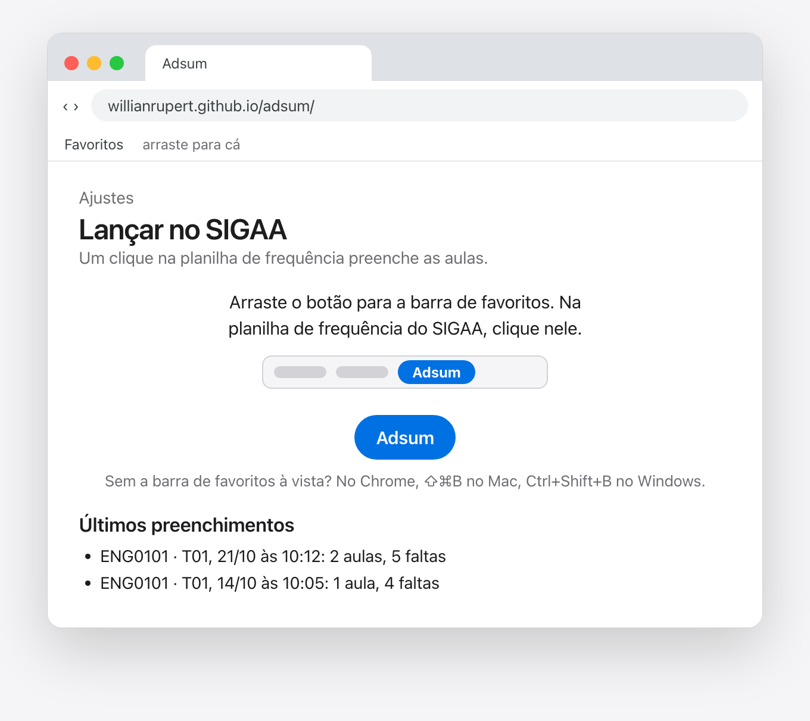
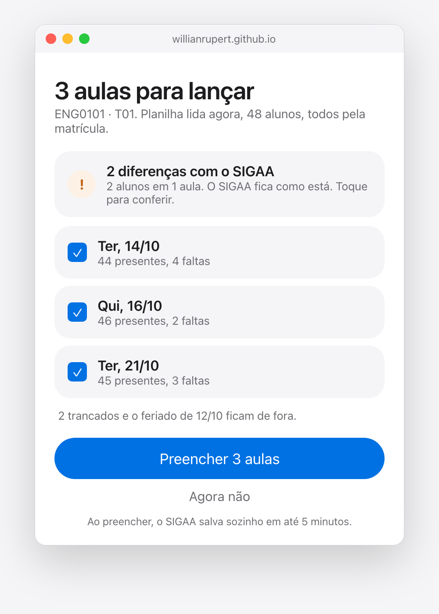
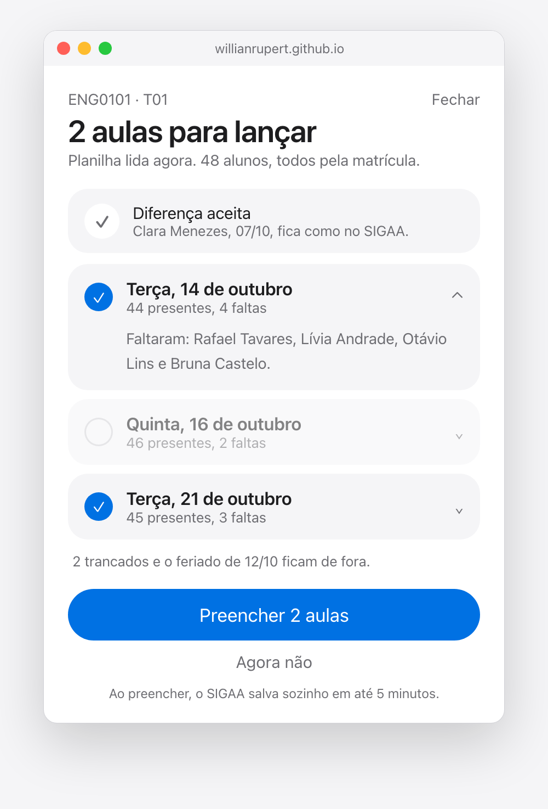
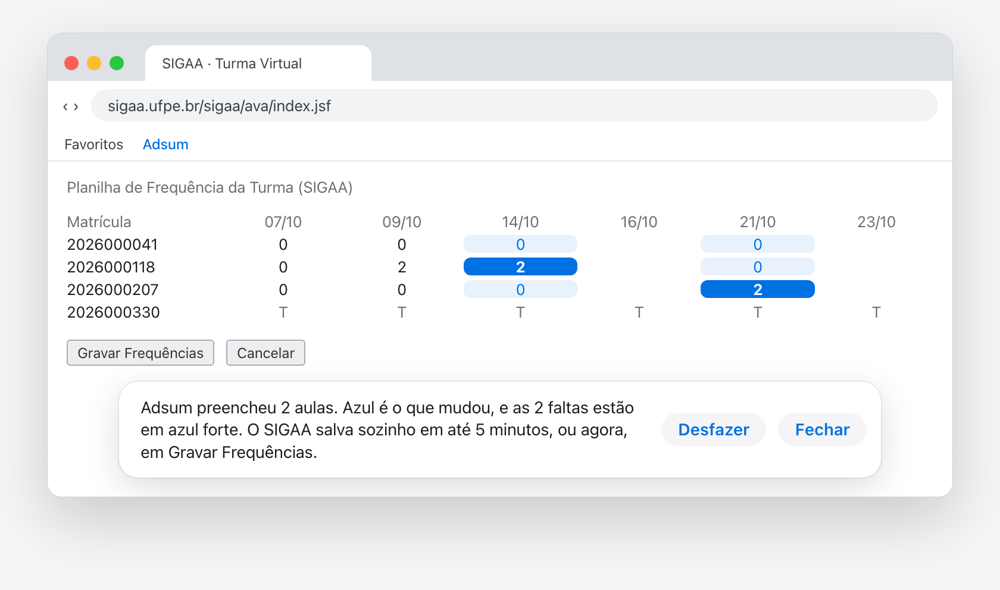
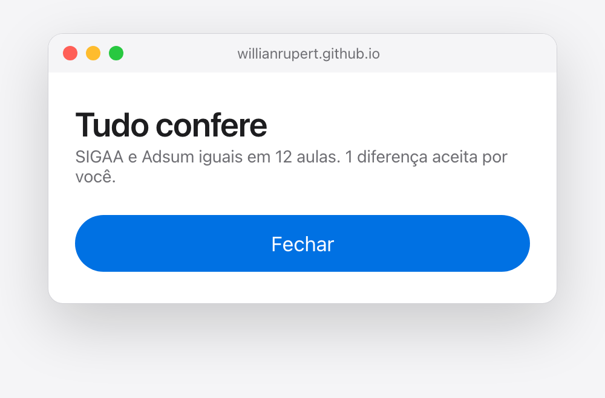
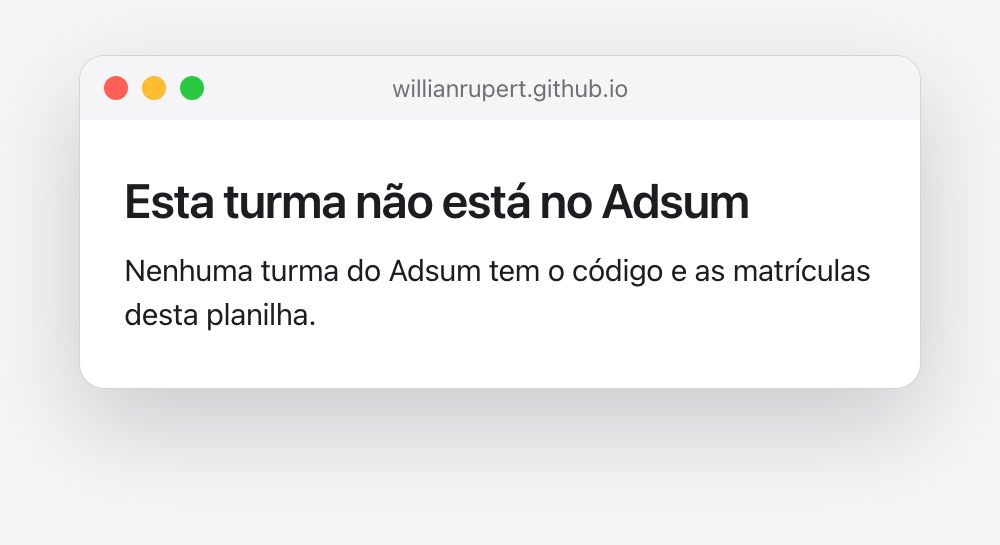
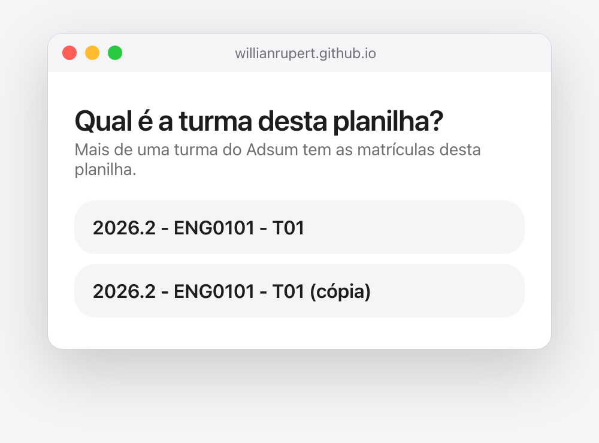
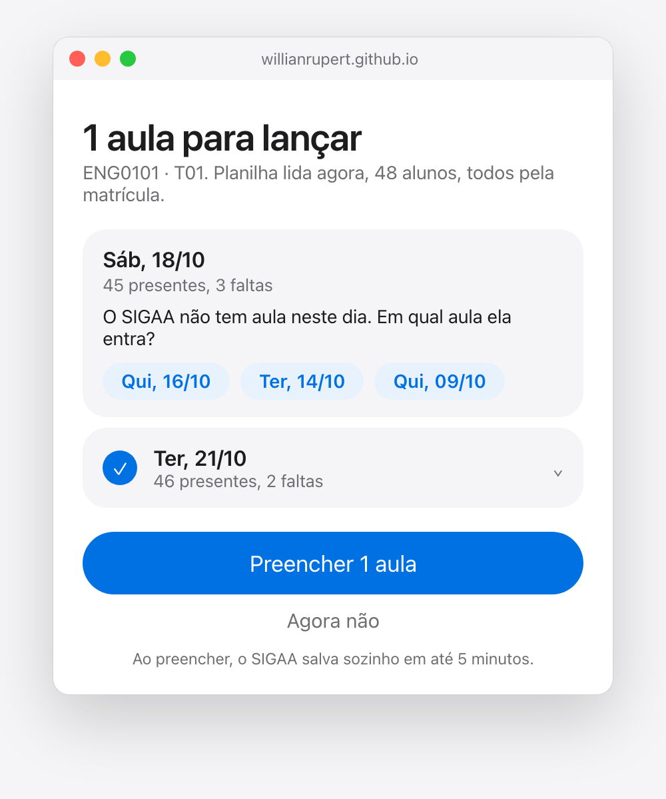

# 09 — Esboço da janela do favorito

As telas da v2 (`docs/08_lancar_no_sigaa.md`). Esboço de 24/09/2026, feito
antes do código; as telas da fase 3 (`docs/11`, passos 23 a 30) foram
redesenhadas em 29/09 conforme implementadas, e as da folha inteira em 30/09,
com os textos do código (`ui/sigaa/FolhaDaTurma.tsx`). As telas de verdade, com gente
inventada, estão na vitrine (`#/vitrine`, em desenvolvimento). É desenho, não captura: o desenho é
[`esboco_sigaa/esboco.html`](esboco_sigaa/esboco.html), com os tokens do
`estilo.css` e gente inventada, e as imagens saem dele por
`scripts/gerar_esboco_sigaa.py`. Mudar uma tela é mudar o HTML e rodar o
script de novo.

A regra que todas seguem: **a janela é o Adsum, não uma tela nova.** Mesma
cor, mesma pílula, mesmo cartão, nenhuma sombra nem
borda separando conteúdo. O professor reconhece a janela antes de ler uma
palavra.

## 1. Instalar, uma vez

Nos Ajustes. O botão azul "Adsum" é o favorito, gerado no build: **arrasta-se**
para a barra, e o gesto está desenhado acima dele. Clicado ali, não roda:
diz que é para arrastar. Embaixo, os últimos preenchimentos, um por linha.

## 2. Há o que lançar

O que o professor vê ao clicar no favorito na planilha do SIGAA.

- **O título é o estado, numa frase.** A linha de apoio diz de onde veio a
  informação: planilha lida agora, todos pela matrícula.
- **A diferença vem primeiro**, num cartão só e fechado, porque é a única
  coisa que pede julgamento: quantas, de quantos alunos, em quantas aulas.
  Nenhum nome aparece sem o professor pedir (decidido pelo autor em
  01/10/2026: com vários alunos, um cartão por diferença virava uma pilha).
  Aberto, por aula, um aluno por linha, com os dois valores e "Aceitar o
  SIGAA". "O SIGAA fica como está." tira o medo antes de ele aparecer, e
  "Aceitar o SIGAA" fica onde a decisão acontece.
- **Cada aula é um cartão** com a caixa azul de incluir.
- **Uma ação só, que diz o que vai fazer**: "Preencher 3 aulas". Abaixo,
  quieto, "Agora não".
- **A garantia sempre visível.** No primeiro esboço, "Nada é gravado aqui.
  Você confere e grava no SIGAA." A planilha real salva sozinha a cada 5
  minutos (`docs/12`), e a frase passou a ser "Ao preencher, o SIGAA salva
  sozinho em até 5 minutos." (29/09).
- O que não pede atenção (trancados, feriado) cabe numa linha.

## 3. O professor escolhe

A mesma janela depois de três gestos: a diferença foi aceita e virou uma
linha quieta; a quinta-feira foi desmarcada e fica de fora; a terça foi
aberta e mostra **quem faltou, pelo nome**, um por linha: a prova por trás
do número. O
título e o botão acompanham: "2 aulas".

## 4. De volta à planilha

Preencher fecha a janela. Na planilha, azul claro é presença que o Adsum
escreveu, **azul forte com o número em branco é falta**: é o que se confere
à mão, e o cartão diz quantas são. A aula desmarcada ficou vazia. O cartão
flutua no pé, claro ou escuro como o sistema, com **Desfazer** enquanto a
página não coletou. O favorito mora na barra de favoritos. Os botões do
SIGAA continuam do SIGAA: quem grava é o professor.

Em tela cheia no Mac, o Chrome abre a janela como aba. A folha, então,
fica centrada, com o ícone do Adsum no alto, e ao Preencher a aba fecha e a
planilha volta.

## 5. Tudo confere

O favorito de novo, depois do Gravar. Uma frase e um botão. A diferença que
o professor aceitou aparece como fato na linha de apoio, não como erro.

## 6. Recusa

Nunca um beco: diz o que houve e o que fazer. Se o favorito falhar, o chão é
"Ver presenças" no Adsum, onde está quem faltou em cada aula, para lançar à
mão. A lista própria para isso saiu em 29/09.

## 7. Qual é a turma

Quando duas turmas do Adsum servem (uma cadastrada duas vezes), a folha
pergunta, em vez de recusar. Se a turma não tem o código da disciplina no
nome, a pergunta é outra, "Esta planilha é de ENG0101", com "Usar" e "Não é
esta"; confirmada uma vez, não se repete.

## 8. A aula dada em outra data

O professor realocou a aula, e a chamada está num dia que o SIGAA não tem.
Quem decide o lugar é ele: as aulas possíveis (sem chamada, não lançadas),
da mais perto para a mais longe. Um toque, e a aula escolhida entra na lista
com "Chamada de Sáb, 18/10" e Desfazer.

## As três perguntas, decididas

Decididas pelo autor em 27/09/2026, as três pelo que o esboço já mostrava:

1. **Nomes de quem faltou: atrás do toque.** O cartão da aula mostra só
   números; tocar nele mostra quem faltou, pelo nome. Conferir é possível,
   expor no projetor por acidente não.
2. **"Agora não" só fecha.** Pintar as diferenças de laranja na planilha pede
   que o plano leve as diferenças junto; pode vir depois.
3. **Aceitar o SIGAA: um toque, com Desfazer.** O ajuste é só acréscimo, e
   voltar atrás grava um segundo ajuste com o valor do Adsum; a linha mostra
   Desfazer até a janela fechar.
